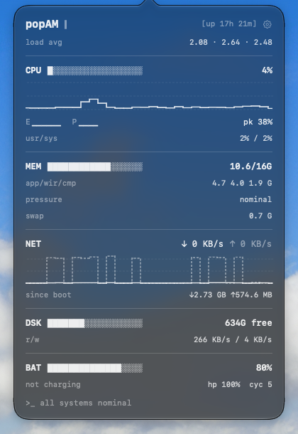

<p align="center">
  
</p>

<h1 align="center">popAM</h1>

<p align="center">
  A tiny activity monitor that lives in your Mac's menu bar.<br>
  Click the gauge to see CPU, memory, network, disk and battery at a glance.
</p>

<p align="center">
  
  
  
  
</p>

## What's in the popover

Every reading is one line of monospaced ink: block bars, step-line graphs, and a few numbers. It follows your Mac's appearance, white ink on dark glass or black ink on light.

| Line | What it tells you |
| --- | --- |
| `load avg`, `[up 3d 4h]` | 1, 5 and 15 minute load averages, and time since boot |
| `CPU ████░░░░ 23%` | Total CPU use, with a step-line graph of the last 30 samples |
| `E ▁▁▂  P ▃▅▂▆` | One glyph per core, grouped into efficiency and performance cores on Apple Silicon |
| `pk`, `usr/sys` | Peak over the graph window, and the user and system split |
| `MEM`, `app/wir/cmp` | Memory used of total, split into app, wired and compressed |
| `pressure`, `swap` | Memory pressure and swap in use |
| `NET ↓ ↑`, `since boot` | Download and upload speed on a live graph, and totals since boot |
| `DSK`, `r/w` | Free space on the startup volume, and read and write speed |
| `BAT`, `hp`, `cyc` | Charge, time to full or empty, battery health, and cycle count |
| `>_ all systems nominal` | Changes to a warning when memory pressure rises or the battery drops below 20% |

## Make it yours

- Turn off the cards you don't need and drag the rest into your order.
- Show just the gauge in the menu bar, or add one or two live values next to it, like `23% · 8.1G`.
- Refresh every 1, 2 or 5 seconds.
- Launch at login.

## Private by design

popAM reads everything straight from macOS and never touches the network. It runs in the App Sandbox without the network entitlement, so it couldn't make a connection if it tried. There are no accounts, no analytics and no update checks.

| Reading | Where it comes from |
| --- | --- |
| CPU | `host_processor_info`, `hw.perflevel` |
| Memory | `host_statistics64`, `vm.swapusage` |
| Network | `getifaddrs` interface counters |
| Disk | Volume capacity, `IOBlockStorageDriver` statistics |
| Battery | IOPowerSources, `AppleSmartBattery` |

## Install

popAM is built from source for now. You need Xcode and macOS 14 (Sonoma) or later.

```bash
git clone https://github.com/Kaustubh-Pasu/popAM.git && cd popAM
open PopAM.xcodeproj           # then press ⌘R
```

Or build a release copy from the terminal and put it in Applications:

```bash
xcodebuild -project PopAM.xcodeproj -scheme PopAM -configuration Release \
  -destination 'generic/platform=macOS' -derivedDataPath build build
cp -R build/Build/Products/Release/popAM.app /Applications/
```

The app is ad-hoc signed and not notarized. If macOS blocks it the first time, right-click it in Finder, choose Open, then confirm.

<details>
<summary>Editing the project file</summary>

The Xcode project is generated from `project.yml` with [XcodeGen](https://github.com/yonaskolb/XcodeGen) (`brew install xcodegen`). You only need it if you edit `project.yml`; then run `xcodegen generate`.

</details>

## Tests

```bash
cd PopAMCore && swift test
```

## Roadmap

Planned for v2: GPU usage, temperatures and fans, top processes, power flow, and battery temperature.

## License

[MIT](LICENSE)
